# 🤖 AI Customer Support Agent


> An intelligent, function-calling AI agent that handles customer support queries, manages orders, and processes tickets in real-time.


## 🚀 Overview

The **AI Customer Support Agent** is a modern web application that leverages **OpenAI's GPT-4** (or compatible models) to provide automated customer service. Unlike standard chatbots, this agent can **execute real functions** to interact with a database, allowing it to:

- 📦 **Check Order Status**: Retrieve real-time shipping and delivery details.
- 🎫 **Manage Support Tickets**: Check status or create new tickets instantly.
- 👤 **Update User Profiles**: Modify account information securely.

Built with **FastAPI** for high performance and a clean **HTML/CSS/JS** frontend, this project demonstrates the power of **Agentic AI** in enterprise environments.

## ✨ Key Features

- **Function Calling**: The LLM intelligently decides when to call Python functions to fetch or modify data.
- **Context Awareness**: Maintains conversation history for a natural, continuous dialogue.
- **Brand Persona**: Enforced system prompts ensure the agent remains professional, concise, and helpful.
- **Robust Logging**: Tracks every interaction and error for monitoring and debugging.
- **Modern UI**: A glassmorphism-inspired interface with responsive design and smooth animations.

## 🏗️ Architecture

```mermaid
graph TD
    User[👤 User] -->|Chat Message| UI[💻 Frontend]
    UI -->|POST /chat| API[🚀 FastAPI Backend]
    API -->|Conversation History| LLM[🧠 OpenAI GPT-4]
    LLM -->|Tool Call Request| API
    API -->|Execute Function| DB[(🗄️ SQLite Database)]
    DB -->|Data| API
    API -->|Tool Output| LLM
    LLM -->|Final Response| API
    API -->|JSON Response| UI
```



## 🛠️ Getting Started

### Prerequisites

- Python 3.10 or higher
- OpenAI API Key (or OpenRouter/compatible key)

### Installation

1.  **Clone the repository**
    ```bash
    git clone https://github.com/yourusername/ai-support-agent.git
    cd ai-support-agent
    ```

2.  **Create a virtual environment**
    ```bash
    python -m venv .venv
    source .venv/bin/activate  # On Windows: .venv\Scripts\activate
    ```

3.  **Install dependencies**
    ```bash
    pip install -r requirements.txt
    ```

4.  **Configure Environment**
    Create a `.env` file in the root directory:
    ```env
    OPENAI_API_KEY=your_api_key_here
    # Optional: OPENAI_BASE_URL=https://openrouter.ai/api/v1
    DATABASE_URL=sqlite:///./ai_support_agent.db
    ```

5.  **Initialize Database**
    ```bash
    python database/init_db.py
    ```

### Usage

1.  **Start the Server**
    ```bash
    python -m uvicorn api.main:app --reload
    ```

2.  **Access the App**
    Open your browser and navigate to `http://localhost:8000`.

3.  **Try these prompts:**
    - "Where is my order ORD-123?"
    - "I need to change my email to new@example.com"
    - "Create a ticket for a broken screen"

## 📂 Project Structure

```
ai-support-agent/
├── api/
│   ├── main.py          # FastAPI application & endpoints
│   ├── functions.py     # Tool definitions & execution logic
├── database/
│   ├── init_db.py       # Database initialization script
│   ├── queries.py       # SQL queries & DB interactions
│   ├── schema.sql       # Database schema
├── static/
│   ├── index.html       # Frontend interface
├── assets/              # Images and static assets
├── requirements.txt     # Python dependencies
└── README.md            # Project documentation
```

## 🔮 Future Improvements

- [ ] **Vector Search**: Integrate embeddings to answer FAQ questions from a knowledge base.
- [ ] **Email Integration**: Send confirmation emails when tickets are created.
- [ ] **Voice Mode**: Add speech-to-text and text-to-speech for voice support.
- [ ] **Dashboard**: Admin panel to view analytics and manage tickets.

---

<div align="center">
  <sub>Built with ❤️ by [Your Name]</sub>
</div>